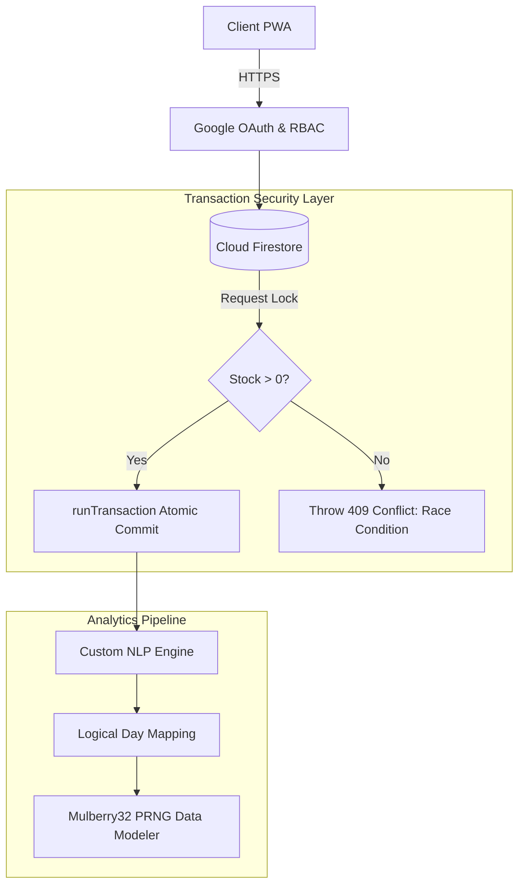

# 🍜 Maggino's | Distributed Noodle Logistics & Edge NLP

[](#)
[](#)
[](#)
[](#)
[](#)

> **The Problem:** A late-night hostel Maggi stall experiencing extreme burst traffic between 12:00 AM and 3:00 AM, leading to race conditions on inventory, dropped orders over unstable college Wi-Fi, and fragmented feedback.
>
> **The Solution:** A highly concurrent Progressive Web App (PWA) backed by atomic database locks, featuring a zero-dependency NLP engine engineered from first principles to run sentiment analysis directly at the edge.

🔗 **[Live Demo](#)** | 📖 **[Read the LinkedIn Architecture Breakdown](#)**

<div align="center">
  <video src="[https://raw.githubusercontent.com/Ash-Myth1/magginos-app/main/github/assets/hero-demo.mp4](https://github.com/Ash-Myth1/magginos-app/raw/main/github/assets/hero-demo.mp4)" autoplay loop muted playsinline width="800"></video>
  <p><i>Live PWA Demonstration: Fluid Framer Motion UI and dynamic routing.</i></p>
</div>

---

## 🧠 Core Data Science & NLP (Zero-Dependency)

I deliberately bypassed black-box APIs (OpenAI, HuggingFace) to build an **Aspect-Based Sentiment Engine** from scratch. This guarantees zero network latency, zero API costs, and proves a fundamental understanding of NLP algorithms.

### 1. Zero-Dependency NLP Engine
* **Regex Clause Segmentation:** Complex reviews are programmatically split into independent logical clauses before scoring to prevent blended average errors.
* **Levenshtein Distance Fuzzy Matching:** Hand-coded algorithm to catch common late-night typos, ensuring misspelled keywords still accurately trigger sentiment weights.
* **3-Token Negation Window:** Context-aware polarity flipping looks up to three tokens behind an aspect word to detect negations (e.g., *not*, *hardly*, *without*).

<div align="center">
  
  <p><i>Live Operations Intelligence dashboard isolating compound student reviews into specific performance aspects.</i></p>
</div>

<details>
<summary><b>🔍 Deep Dive: The Algorithmic NLP Pipeline (Click to expand)</b></summary>
<br>

**1. Segmentation Logic**
Standard sentiment analysis fails on compound reviews. The engine uses regex boundaries to split inputs before scoring.
* *Input:* `"The classic maggi was amazing but delivery was incredibly l8 and cold"`
* *Clause 1:* `["classic maggi", "amazing"]` ➔ Scores Aspect: Food
* *Clause 2:* `["delivery", "incredibly l8", "cold"]` ➔ Scores Aspect: Logistics

**2. Fuzzy Matching Implementation**
Late-night typing is notoriously inaccurate. I implemented a Levenshtein distance matrix to calculate the minimum number of single-character edits required to match a string.
* `l8` matches `late` (Distance: 2)
* `delivry` matches `delivery` (Distance: 1)
</details>

### 2. Time-Series Forecasting & XAI
* **Pace Extrapolation:** Forecasts inventory burn-down using live-pace mapping against historical midnight demand curves.
* **Explainable AI (XAI) Wastage Risk:** Outputs a 5-factor risk score for stockouts/wastage. Rather than a black-box percentage, the system provides plain-English deterministic reasoning for its risk assessment.

<div align="center">
  
  <p><i>Explainable AI scoring providing deterministic, plain-English reasoning for stockout and wastage risks based on historical pacing.</i></p>
</div>

---

## ⚡ Architecture & Concurrency Control



### 1. Atomic Double-Layered Stock Enforcement
Midnight rushes mean multiple students attempt to order the final Maggi simultaneously. I engineered strict concurrency safety using **Firestore `runTransaction`** to implement server-side atomic read-validate-write protocols. 

```typescript
// Core implementation of the atomic transaction lock
await runTransaction(db, async (transaction) => {
  const stockDoc = await transaction.get(inventoryRef);
  if (stockDoc.data().current_stock < orderQuantity) {
    throw new Error("Race condition prevented: Out of stock.");
  }
  transaction.update(inventoryRef, { 
    current_stock: increment(-orderQuantity) 
  });
});
```

### 2. "Logical Day" Domain Modeling
Standard `Date()` objects fail for businesses operating across midnight. I engineered a `Logical Day` model. An order placed at **2:30 AM on Wednesday** is programmatically shifted and mapped to the **"Tuesday Night"** logical dataset, preventing fragmented analytics.

<div align="center">
  
  <p><i>The Logical Day matrix successfully mapping the 11 PM to 5 AM timeframe into a single, contiguous operational shift.</i></p>
</div>

### 3. Deterministic PRNG Load Simulation
To stress-test the system, I implemented a hand-built **mulberry32 PRNG** (Pseudo-Random Number Generator) to simulate power-law popularity skews. This ensures load-testing data is mathematically deterministic, perfectly reproducible, and not just randomly chaotic.

---

## 🛠️ DevOps & Production Execution

* **TypeScript Domain Modeling:** Strict interfaces and literal unions ensure malformed payloads cannot reach the data layer. 
* **Hard-Scoped Data Security:** Firebase Security Rules physically prevent unauthorized data fetching at the database level, ensuring the client cannot be manipulated into bypassing RBAC (Role-Based Access Control).
* **Load Testing (k6):** Validated system integrity by simulating **50 concurrent virtual users** executing transaction scripts against the live Firebase REST endpoint to verify quota isolation.
* **Zero-Downtime CI/CD:** A GitHub Actions workflow automatically blocks production deployments to Vercel if strict TypeScript compilation or test processes fail.
* **Dual-Strategy Service Worker:** Deployed as an installable PWA designed for unstable hostel Wi-Fi, featuring aggressive local caching with an explicit bypass for live transactional endpoints.

---

## 💻 Tech Stack Snapshot
* **Core:** React (Vite), TypeScript, Tailwind CSS, Framer Motion
* **Infrastructure:** Firebase (Firestore, Auth, Security Rules), Vercel
* **DevOps:** k6 Load Testing, GitHub Actions
* **Custom Algorithms:** Levenshtein Matrix, Mulberry32 PRNG, Regex Heuristics

---
*Architected and developed by Ashmit Srivastava. Open to feedback, code reviews, and technical critiques.*
